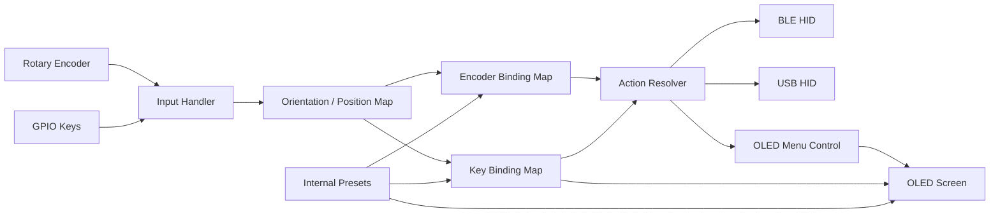

```mermaid


flowchart LR
KEY[GPIO Keys] --> HAND[Input Handler]
ENC[Rotary Encoder] --> HAND

PRE[Internal Presets] --> KMAP[Key Binding Map]
PRE --> EMAP[Encoder Binding Map]

HAND --> ROT[Orientation / Position Map]

ROT --> KMAP
ROT --> EMAP

KMAP --> ACT[Action Resolver]
EMAP --> ACT

ACT --> BLE[BLE HID]
ACT --> USB[USB HID]
ACT --> OLM[OLED Menu Control]

OLED[OLED Screen]
PRE --> OLED
KMAP --> OLED
OLM --> OLED

```