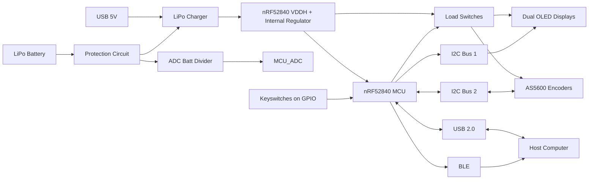
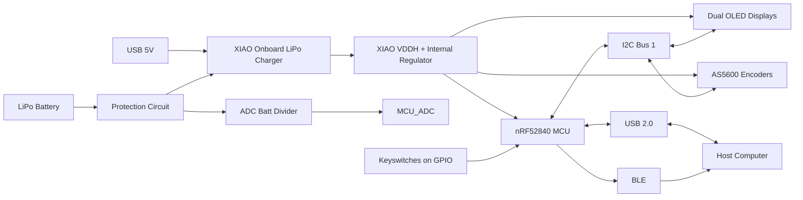

# Multi-Layer Embedded HID Interface with Rotary Input

A programmable HID control interface that replaces discrete key presses with continuous rotary input, enabling precise, context-aware interaction for workflows like video editing and CAD.

**Codename:** Hyper_Wheel
---
## Concept & Inspiration

> Traditional macro pad (left) vs. rotary-first control interface (right)

I’ve wanted a proper timeline control device for video editing for a long time. Dedicated solutions exist, but they tend to be expensive, physically large, and built for professional workflows and overkill for everyday use.

The first step was building a standalone timeline wheel. It worked well as a proof of concept, but the implementation was limited. The chosen development platform (ESP32-C6) never received full wireless integration, and the device remained a single-purpose tool.

To expand functionality, I added a programmable numpad. This improved flexibility, but introduced new problems:
- No clear feedback for what each key was mapped to  
- Increased physical footprint  
- A disjointed user experience between discrete and continuous inputs  

Most macro pads on the market suffer from similar tradeoffs—either too expensive, too cumbersome, or lacking meaningful feedback for dynamic workflows.

---

## Enter Hyper Wheel

Hyper Wheel is a fully integrated control surface that combines continuous rotary input with programmable keys and onboard feedback.

Key design goals:

- **Rotary-first interaction** using a high-resolution magnetic encoder  
- **Tactile control** via a large-format (56 mm ID) bearing-driven wheel  
- **Integrated feedback** through dual OLED displays  
- **Flexible input surface** using modular KS33 mechanical switches  
- **Wireless-first design** built around the nRF52840 (BLE + low power)  
- **Self-contained power system** with LiPo charging and protection circuitry  
- **Enterprise-friendly operation** using standard HID over USB and BLE (no custom drivers)

The result is a compact, portable device that replaces fragmented control schemes with a single, cohesive interface.

## Overview

Hyper Wheel is a programmable HID macro device built around a high-resolution magnetic encoder, designed to provide precise, context-aware control for workflows like video editing, CAD, and embedded development.

Unlike typical macro pads, the primary input is not a button grid but a continuous rotary interface, capable of functioning as a timeline scrubber, fine adjustment control, horizontal scroll input, or system volume control—all within standard HID keyboard and mouse outputs.

The system is designed with enterprise compatibility in mind, avoiding custom drivers and relying entirely on standard USB/BLE HID communication. This constraint drives both firmware architecture and hardware design decisions.

The current iteration focuses on validating a complete embedded system pipeline, including power architecture, multi-layer PCB layout with RF considerations, and scalable input/output expansion.

---

## Core Concept

Unlike traditional macro pads, Hyper Wheel combines:

- **Discrete inputs (keys)**
- **Continuous input (encoder wheel)**
- **Context feedback (dual OLED displays)**

The encoder is fully programmable and can be mapped to:

- Frame-by-frame scrubbing  
- Vertical / horizontal scrolling  
- Volume control  
- Any HID-compatible incremental behavior  

---

## System Architecture

## Key Features

- nRF52840-based system with **BLE + USB HID support**  
- High-resolution **magnetic encoder (AS5600-based)**  
- Dual **I2C OLED displays** for contextual UI feedback  
- **User-defined key mapping** (firmware-controlled)  
- **Left/right-hand agnostic layout** with mode switching  
- **LiPo + USB power architecture**  
- Modular sensor and expansion strategy  
- Fully **driverless operation (standard HID only)**  

---

##  Hardware Overview

The following images highlight key aspects of the PCB design, including routing strategy, RF layout considerations, and multi-layer power distribution.
### Early Concept Render

> *Early prototype render shown for system concept demonstration. Mechanical design is still evolving.*

---

### Full PCB Layout (Routing View)

> Overall PCB layout showing multi-layer routing strategy, peripheral distribution, and controlled RF region placement.

---

##  MCU / RF Region Detail

### Top Layer (Routing)

> nRF52840 fanout and high-density routing region, including USB interface routing and transition into a controlled antenna region.

---

### Ground Reference Layer

> Ground reference layer showing return path continuity, stitching strategy, and antenna clearance region.

---

### Power Distribution Layer || Metal 4

> Multi-zone power distribution separating 3.3V, Load domains, and ground to reduce coupling and improve system stability.

---

##  Layer Stack & Power Distribution

### Full Ground Plane || Metal 3

> Continuous ground plane providing low-impedance return paths across the board and supporting RF performance.

---

### Full Signal Plane || Metal 2

> Second layer signal plane for BGA fanout.

---

### Full Top Plane || Metal 2

> Primary signal plane with all zone ground.

---

## Engineering Highlights

### Single-MCU USB + BLE Architecture
- Transitioned from QFN48 to USB-capable aQFN73. Originally targeted QFN48 for design simplicity, anticipating low GPIO consumptiuon and no NFC requirement. USB-HID necessitated the QFN73.  
- Preserved single-MCU design while enabling USB HID  

---

### Battery-First Power System
- Transitioned from Nordic Config 1 (USB-primary) to Config 4 (VDDH-first) to support battery-backed operation without conflicting power domains. 
- VDDH sourced from charger output; USB VBUS used for detection only. 
- Enables internal DC/DC with DCDCEN0/1, eliminating the external LDO.
- Internal regulator chosen over external due to synergy with Nordic chipset.

---

### RF Design Without RF Tooling
- Used reference antenna layout and controlled ground zones
- Calculated 50 Ohm impedance for antenna trace, based on 2.4GHz and TG155 FR4 board  
- Deferred validation to real-world testing  
- BLE range maximization not a concern, desktop device, not a long range sensor.

---

### Routing Density & Layer Strategy
- Moved key matrix routing to inner layer  
- Improved MCU fanout and reduced congestion
- Maximized VIA size to reduce production costs in BGA fanout  

---

### Iteration Strategy (Firmware First)
- Developed simplified XIAO-based validation board
- Reduces likelyhood of assembly/design based errors enabling firmware deployment
- Version does NOT include low power architecture such as load switches, utilizes onboard XIAO LIPO charger.
- Solder bridges included to bypass non-critical architecture as needed.  
- Enables rapid firmware/UI iteration independent of full hardware  

---

### Avoiding Overengineering
- Abandoned full FEM/PDN simulation workflow  
- Focused on targeted analysis and proven design practices  

---
##  Dev Platform / Prototype

> Simplified firmware validation platform based on the XIAO nRF52840, enabling rapid iteration of firmware and UI behavior prior to full hardware validation.

### Dev System Architecture

---

## Design for Manufacturing (DFM)

This design explicitly considers **PCBA cost and manufacturability**, not just functionality.

- Designed within standard JLCPCB capabilities (no blind vias, no via-in-pad)  
- Optimized via sizing for cost  
- Minimized use of 0201 components where not required  
- Favoring 0402 / 0603 for improved assembly yield  
- Reducing unique BOM values (ongoing)

This ensures the design is **practical for real-world assembly**, not just theoretical performance.

---

##  Assembly / 3D Model

.png>)
> Not all components have linked 3D models. USB and Keyswitches not shown
---

## Current Status

### Hardware
- PCB layout largely complete (multiple iterations)  
- Power architecture implemented  
- Debug/test access integrated  

### Firmware
- Early-stage development  
- HID-based control structure defined  
- Configured via PlatformIO / VSCode  

### Known Limitations / Open Questions

- RF performance not yet validated due to lack of VNA/scope access  
- USB signal integrity not formally measured (routing follows best practices)  
- Multi-device I2C stability under load not yet stress-tested  
- Power behavior under dynamic load switching still to be characterized 

---

## Design Constraints

- Designed for standard PCB manufacturing (JLCPCB) with no blind/buried vias  
- Limited board size due to encoder geometry and enclosure constraints  
- Required HID-only communication for enterprise compatibility  
- Power system designed around single-cell LiPo with safe charge/discharge behavior

### Key Tradeoffs

- Chose single-MCU (nRF52840) over multi-chip architecture to reduce system complexity at the cost of tighter routing constraints  
- Accepted lack of RF simulation tooling and relied on reference layout + conservative design margins  
- Used internal VDDH regulation to simplify power architecture, trading off external regulator flexibility  
- Split I2C buses to manage address conflicts and maintain signal integrity under expansion

---
## Use Cases

**Primary**
- Video editing (timeline scrubbing, precision control)

**Secondary**
- CAD navigation  
- General productivity workflows  
- Custom macro environments  

---

## Future Work

### Firmware

- Development of configurable HID mapping system  
- Exploration of QMK/ZMK compatibility with encoder-based input  
- Potential on-device configuration interface via OLED UI  

### Mechanical

- Final enclosure design around encoder and key layout  
- Mounting strategy for PCB and battery integration  
- Ergonomic considerations for left/right-handed use

---

## Design Philosophy

- Use **standard HID** instead of custom drivers  
- Prioritize **iteration speed over theoretical perfection**  
- Design within **real manufacturing constraints**  
- Document decisions and tradeoffs explicitly  