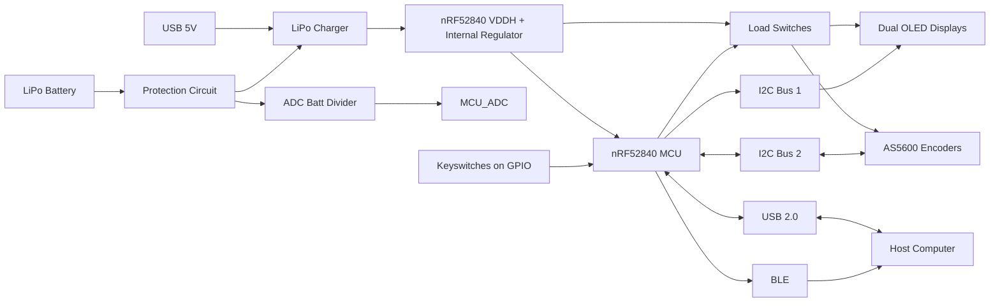
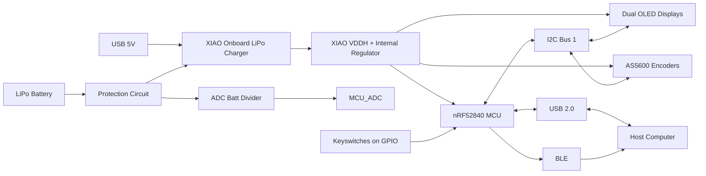

# Multi-Layer Embedded HID Interface with Rotary Input

A programmable HID control interface that replaces discrete key presses with continuous rotary input, enabling precise, context-aware interaction for workflows like video editing and CAD.

**Codename:** Hyper_Wheel

## Engineering Summary

- 4-layer mixed-signal embedded system (98 × 65 mm) based on nRF52840 (BLE + USB HID)
- RF-aware PCB layout with calculated 50Ω antenna trace on TG155 FR4
- Battery-powered architecture (LiPo + charger + protection + load switching)
- Multi-bus I²C system separating OLED displays and encoders for signal integrity
- Designed within JLCPCB DFM constraints (no blind vias, optimized BOM, 0402/0603 preference)
- Staged bring-up strategy using XIAO validation platform to decouple firmware and hardware risk

> > 4-layer mixed-signal PCB with dense MCU fanout, controlled routing, and separated power/RF domains
---

## What This Demonstrates

This project demonstrates the ability to:

- Design a mixed-signal embedded system with RF considerations  
- Make system-level tradeoffs under real constraints (power, layout, manufacturability)  
- Identify and mitigate risk without full simulation tooling  
- Structure hardware bring-up and validation intentionally  

This is not a proof-of-concept—it is a system designed to be built, debugged, and iterated.

---

## Status

- Rev A PCB complete and ready for fabrication  
- Validation hardware in production  
- Firmware development in progress  

---

## Intended Outcome

The goal of this project is to produce a fully functional, portable HID control surface that can be:

- Built using standard PCB manufacturing workflows  
- Assembled and validated without specialized RF tooling  
- Used in real workflows without custom drivers or software dependencies  

Success is defined by reliable operation, predictable behavior, and ease of integration into existing systems.

---

## Concept

### Early Concept Render

> *Early prototype render shown for system concept demonstration. Mechanical design is still evolving.*

Hyper Wheel is a rotary-first HID control surface designed to replace discrete macro inputs with continuous, context-aware control.

The system combines:
- High-resolution rotary encoder input  
- Programmable key matrix  
- Onboard display feedback  

Primary use cases:
- Video editing (timeline scrubbing, precision control)  
- CAD navigation  
- General HID-based workflows  

The design prioritizes:
- Compact form factor  
- Driverless operation (USB/BLE HID only)  
- Integration of continuous and discrete input into a single interface  
---

## System Overview

Hyper Wheel is a programmable HID macro device built around a high-resolution magnetic encoder, designed to provide precise, context-aware control.

Unlike typical macro pads:
- Primary input is continuous (rotary), not discrete  
- Output is standard HID (keyboard + mouse)  
- Feedback is integrated via dual OLED displays  

The system is designed for enterprise compatibility:
- No custom drivers  
- USB and BLE HID only  

Current development focuses on validating:
- Power architecture  
- Multi-layer PCB layout with RF considerations  
- Scalable I/O architecture  

## System Architecture

## Key Features

- nRF52840-based system with **BLE + USB HID support**  
- High-resolution **magnetic encoder (AS5600-based)**  
- Dual **I2C OLED displays** for contextual UI feedback  
- **User-defined key mapping** (firmware-controlled)  
- **Left/right-hand agnostic layout** with mode switching  
- **LiPo + USB power architecture**  
- Modular sensor and expansion strategy  
- Fully **driverless operation (standard HID only)**  

---

## Engineering Highlights

### Single-MCU USB + BLE Architecture
- Transitioned from QFN48 to USB-capable aQFN73 to enable USB HID while maintaining BLE
- Preserved single-MCU architecture to reduce system complexity

### Battery-First Power System
- Implemented Nordic VDDH Config 4 architecture for battery-first operation
- USB used for detection only; system powered from charger output
- Enabled internal DC/DC (DCDCEN0/1), eliminating need for external regulator

### RF Design Approach
- Used reference antenna layout with controlled ground zones
- Calculated 50Ω impedance trace for 2.4 GHz operation on TG155 FR4
- Designed for short-range BLE use (desktop device)
- Validation deferred to hardware bring-up

### Routing Density & Layer Strategy
- Moved key matrix to inner layer to reduce congestion
- Improved fanout of high-density MCU region
- Optimized via sizing for manufacturing cost

### Iteration Strategy (Firmware First)
- Developed XIAO-based validation board to decouple firmware and hardware bring-up
- Allows testing of UI, input pipeline, and HID behavior before full PCB assembly

### Constraint-Driven Design

- Designed without access to RF simulation or SI toolchains, relying on first-principles reasoning and reference layouts to achieve first-pass success  
- Applied calculated trace geometry and conservative design margins to mitigate signal integrity risk  
- Prioritized manufacturability and iteration speed over theoretical optimization  
- Structured design to enable validation through hardware bring-up rather than pre-simulation

---

## Key Engineering Decisions

- **Single-MCU architecture (nRF52840)**  
  Reduced system complexity while supporting both BLE and USB HID

- **Battery-first power design (VDDH Config 4)**  
  Enabled seamless USB + battery operation without conflicting domains

- **Split I²C buses**  
  Prevented address conflicts and improved signal integrity under expansion

- **HID-only communication (no custom drivers)**  
  Ensures enterprise compatibility and plug-and-play behavior

- **Staged bring-up using validation hardware**  
  Reduced risk by separating firmware development from full system assembly

- **Conservative RF design without simulation tooling**  
  Relied on reference layouts and controlled geometry with validation deferred to hardware
---

## Validation Status

| Area | Status |
|------|--------|
| Power System | Not yet characterized under load |
| RF Performance | Not validated (no RF test equipment available) |
| USB Signal Integrity | Not measured |
| I2C Stability | Not stress-tested |
| Firmware Integration | In progress |

> Validation strategy is structured to isolate failure modes early, reducing system-level debugging complexity during full integration

> Firmware bring-up and subsystem testing occurring prior to full hardware integration.

---

## Power Profile (Preliminary)

The following figures are early design estimates based on component datasheets and expected operating modes. Final values will be validated during bring-up.

### Component-Level Current Estimates

| Component / Mode | Estimated Current | Notes |
|------|------:|------|
| nRF52840, BLE active (+8 dBm) | 14.8 mA | Active BLE operating point on 3.3 V rail |
| OLED display (each) | 12–20 mA | 0.96" Winstar OLED at 3.3 V, ~50% illumination |
| AS5600 encoder (each, active) | 6.4 mA | Active measurement mode |
| Keyswitches | ~0 mA | No static consumption |
| nRF52840 system-off, RAM retained, wake on GPIOTE | 2.36 µA | MCU-only low-power state |

### Estimated System Current

| System Mode | Estimated Current | Notes |
|------|------:|------|
| Active, one OLED + one encoder + BLE | ~33.2–41.2 mA | 14.8 + 12–20 + 6.4 |
| Active, two OLEDs + one encoder + BLE | ~45.2–61.2 mA | Current main-board target configuration |
| Active, two OLEDs + two encoders + BLE | ~51.6–67.6 mA | Higher-end fully populated case |
| Deep sleep / system-off | ~33 µA | Includes MCU, charger, protection IC, hall sensor, FET leakage, and battery divider |

### Estimated Runtime (2000 mAh LiPo)

| Mode | Estimated Runtime |
|------|------:|
| 45.2 mA active draw | ~44 hours |
| 61.2 mA active draw | ~33 hours |
| 67.6 mA active draw | ~30 hours |
| 33 µA sleep current | ~6.9 years theoretical |

Sleep-current validation will also include key-matrix wake behavior, since retained GPIO pullups can dominate standby current if not configured carefully.

> Sleep-mode runtime is a first-order electrical estimate only and does not account for battery self-discharge, cell aging, converter losses, or environmental effects.

> These values are estimates and will be validated during hardware bring-up.

##  Hardware Overview

The following images highlight key aspects of the PCB design, including routing strategy, RF layout considerations, and multi-layer power distribution.

---

### Full PCB Layout (Routing View)

> Overall PCB layout showing multi-layer routing strategy, peripheral distribution, and controlled RF region placement.

---

##  MCU / RF Region Detail

### Top Layer (Routing)

> nRF52840 fanout and high-density routing region, including USB interface routing and transition into a controlled antenna region.

---

### Ground Reference Layer

> Ground reference layer showing return path continuity, stitching strategy, and antenna clearance region.

---

### Power Distribution Layer || Metal 4

> Multi-zone power distribution separating 3.3V, Load domains, and ground to reduce coupling and improve system stability.

---

##  Layer Stack & Power Distribution

### Full Ground Plane || Metal 3

> Continuous ground plane providing low-impedance return paths across the board and supporting RF performance.

---

### Full Signal Plane || Metal 2

> Second layer signal plane for BGA fanout.

---

### Full Top Plane || Metal 1

> Primary signal plane with all zone ground.

---

##  Dev Platform / Prototype

> Simplified firmware validation platform based on the XIAO nRF52840, enabling rapid iteration of firmware and UI behavior prior to full hardware validation.

### Dev System Architecture

---

## Hardware Iterations

### Rev A – Firmware Validation Platform
- XIAO nRF52840-based
- Reduced feature set to validate input, display, and HID stack
- 2-layer board for reduced cost/complexity

.png>) 
> Rev A Board.

.png>)
> Rev B board, note change in keyswitch footprints and added jumper network
### Rev B – Connector + Layout Refinement
- Introduced JST right-angle connectors (2/4/6 pin)
- Retained 2.54mm headers for bring-up flexibility
- Implemented rotationally symmetric connector layout
  - Enables cross-compatibility between 4-pin and 6-pin harnesses
  - Increased routing complexity but improved wiring consistency
- Adjusted OLED power routing for improved modularity

.png>).png>)
> Right shows the reconfigurable jumper array to switch GND and VCC pins to OLED

### Key Takeaways
- Connector standardization impacts both layout complexity and user error rate
- Bring-up flexibility is worth temporary redundancy (2.54 + JST)
- Physical interface decisions cascade into firmware, assembly, and usability

## Design for Manufacturing (DFM)

This design explicitly considers **PCBA cost and manufacturability**, not just functionality.

- Designed within standard JLCPCB capabilities (no blind vias, no via-in-pad)  
- Optimized via sizing for cost  
- Minimized use of 0201 components where not required  
- Favoring 0402 / 0603 for improved assembly yield  
- Reducing unique BOM values (ongoing)

This ensures the design is **practical for real-world assembly**, not just theoretical performance.

---

##  Assembly / 3D Model

.png>)
> Not all components have linked 3D models. USB and Keyswitches not shown
---

## Current Status

### Hardware
- Main PCB: Ready for fabrication (Rev A)  
- XIAO-based validation boards: Fabricated, awaiting delivery  
- Power architecture implemented (VDDH-based system)  
- Multi-layer routing and RF region defined  
- Test points and debug access integrated  

### Firmware
- Early development in progress (PlatformIO)  
- HID architecture defined (USB + BLE)  
- Encoder and display integration in progress  
- UI/UX layer not yet implemented  

### Mechanical
- Concept prototype complete (wheel + macro pad)  
- Final enclosure design pending  
- Mounting and integration strategy in development  

---

### Next Milestones

1. Bring-up XIAO validation platform  
2. Validate encoder and OLED pipeline  
3. Verify power behavior under real load  
4. Assemble Rev A main board  
5. Begin enclosure integration  

---

## Design Constraints

- Designed for standard PCB manufacturing (JLCPCB) with no blind/buried vias  
- Limited board size due to encoder geometry and enclosure constraints  
- Required HID-only communication for enterprise compatibility  
- Power system designed around single-cell LiPo with safe charge/discharge behavior

### Key Tradeoffs

- Chose single-MCU (nRF52840) over multi-chip architecture to reduce system complexity at the cost of tighter routing constraints  
- Accepted lack of RF simulation tooling and relied on reference layout + conservative design margins  
- Used internal VDDH regulation to simplify power architecture, trading off external regulator flexibility  
- Split I2C buses to manage address conflicts and maintain signal integrity under expansion

---
## Use Cases

**Primary**
- Video editing (timeline scrubbing, precision control)

**Secondary**
- CAD navigation  
- General productivity workflows  
- Custom macro environments  

---

## Future Work

### Firmware

- Development of configurable HID mapping system  
- Exploration of QMK/ZMK compatibility with encoder-based input  
- Potential on-device configuration interface via OLED UI  

### Mechanical

- Final enclosure design around encoder and key layout  
- Mounting strategy for PCB and battery integration  
- Ergonomic considerations for left/right-handed use

---

## Design Philosophy

- Use **standard HID** instead of custom drivers  
- Prioritize **iteration speed over theoretical perfection**  
- Design within **real manufacturing constraints**  
- Document decisions and tradeoffs explicitly  