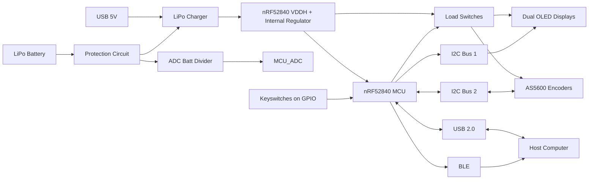

# Programmable HID Precision Controller  
### *Codename: Hyper Wheel*

> A driverless, programmable input device combining discrete keys and a high-resolution encoder for precision workflows.

---
##  Project Inspiration / Physical Concept

---

## Overview

Hyper Wheel is a custom-designed input device built around a magnetic encoder and configurable key matrix, intended for high-precision control in workflows like video editing, CAD, and general productivity.

The system operates entirely within standard HID keyboard/mouse outputs, making it **enterprise-friendly with no custom drivers required**, while still supporting flexible, firmware-defined behavior.

This project demonstrates **end-to-end embedded system design**, from schematic and PCB layout through firmware architecture and manufacturability considerations.

---

## Core Concept

Unlike traditional macro pads, Hyper Wheel combines:

- **Discrete inputs (keys)**
- **Continuous input (encoder wheel)**
- **Context feedback (dual OLED displays)**

The encoder is fully programmable and can be mapped to:

- Frame-by-frame scrubbing  
- Vertical / horizontal scrolling  
- Volume control  
- Any HID-compatible incremental behavior  

---

## System Architecture

## Key Features

- nRF52840-based system with **BLE + USB HID support**  
- High-resolution **magnetic encoder (AS5600-based)**  
- Dual **I2C OLED displays** for contextual UI feedback  
- **User-defined key mapping** (firmware-controlled)  
- **Left/right-hand agnostic layout** with mode switching  
- **LiPo + USB power architecture**  
- Modular sensor and expansion strategy  
- Fully **driverless operation (standard HID only)**  

---

##  Hardware Overview

The following images highlight key aspects of the PCB design, including routing strategy, RF layout considerations, and multi-layer power distribution.
### Early Concept Render

> *Early prototype render shown for system concept demonstration. Mechanical design is still evolving.*

---

### Full PCB Layout (Routing View)

> Overall PCB layout showing multi-layer routing strategy, peripheral distribution, and controlled RF region placement.

---

##  MCU / RF Region Detail

### Top Layer (Routing)

> nRF52840 fanout and high-density routing region, including USB interface routing and transition into a controlled antenna region.

---

### Ground Reference Layer

> Ground reference layer showing return path continuity, stitching strategy, and antenna clearance region.

---

### Power Distribution Layer || Metal 4

> Multi-zone power distribution separating 3.3V, Load domains, and ground to reduce coupling and improve system stability.

---

##  Layer Stack & Power Distribution

### Full Ground Plane || Metal 3

> Continuous ground plane providing low-impedance return paths across the board and supporting RF performance.

---

### Full Signal Plane || Metal 2

> Second layer signal plane for BGA fanout.

---

### Full Top Plane || Metal 2

> Primary signal plane with all zone ground.

---

## Engineering Highlights

### Single-MCU USB + BLE Architecture
- Transitioned from QFN48 to USB-capable aQFN73  
- Preserved single-MCU design while enabling USB HID  

---

### Battery-First Power System
- Migrated to Nordic Config 4 (VDDH-based)  
- Enabled DC/DC regulation and efficient battery operation  

---

### RF Design Without RF Tooling
- Used reference antenna layout and controlled ground zones  
- Deferred validation to real-world testing  

---

### Routing Density & Layer Strategy
- Moved key matrix routing to inner layer  
- Improved MCU fanout and reduced congestion  

---

### Iteration Strategy (Firmware First)
- Developed simplified XIAO-based validation board  
- Enabled rapid firmware/UI iteration independent of full hardware  

---

### Avoiding Overengineering
- Abandoned full FEM/PDN simulation workflow  
- Focused on targeted analysis and proven design practices  

---
##  Dev Platform / Prototype

> Simplified firmware validation platform based on the XIAO nRF52840, enabling rapid iteration of firmware and UI behavior prior to full hardware validation.

---

## Design for Manufacturing (DFM)

This design explicitly considers **PCBA cost and manufacturability**, not just functionality.

- Designed within standard JLCPCB capabilities (no blind vias, no via-in-pad)  
- Optimized via sizing for cost  
- Minimized use of 0201 components where not required  
- Favoring 0402 / 0603 for improved assembly yield  
- Reducing unique BOM values (ongoing)

This ensures the design is **practical for real-world assembly**, not just theoretical performance.

---

## 📸 Assembly / 3D Model

.png>)
---

## Current Status

### Hardware
- PCB layout largely complete (multiple iterations)  
- Power architecture implemented  
- Debug/test access integrated  

### Firmware
- Early-stage development  
- HID-based control structure defined  
- Configured via PlatformIO / VSCode  

### Not Yet Validated
- RF performance (antenna tuning)  
- Power behavior under load  
- Multi-device I2C stability  
- Final USB signal integrity  

---

## Use Cases

**Primary**
- Video editing (timeline scrubbing, precision control)

**Secondary**
- CAD navigation  
- General productivity workflows  
- Custom macro environments  

---

## Future Work

- On-device key remapping (menu-driven UI)  
- QMK/ZMK firmware exploration  
- Improved encoder abstraction  
- External module expansion  
- Final enclosure design  

---

## Design Philosophy

- Use **standard HID** instead of custom drivers  
- Prioritize **iteration speed over theoretical perfection**  
- Design within **real manufacturing constraints**  
- Document decisions and tradeoffs explicitly  